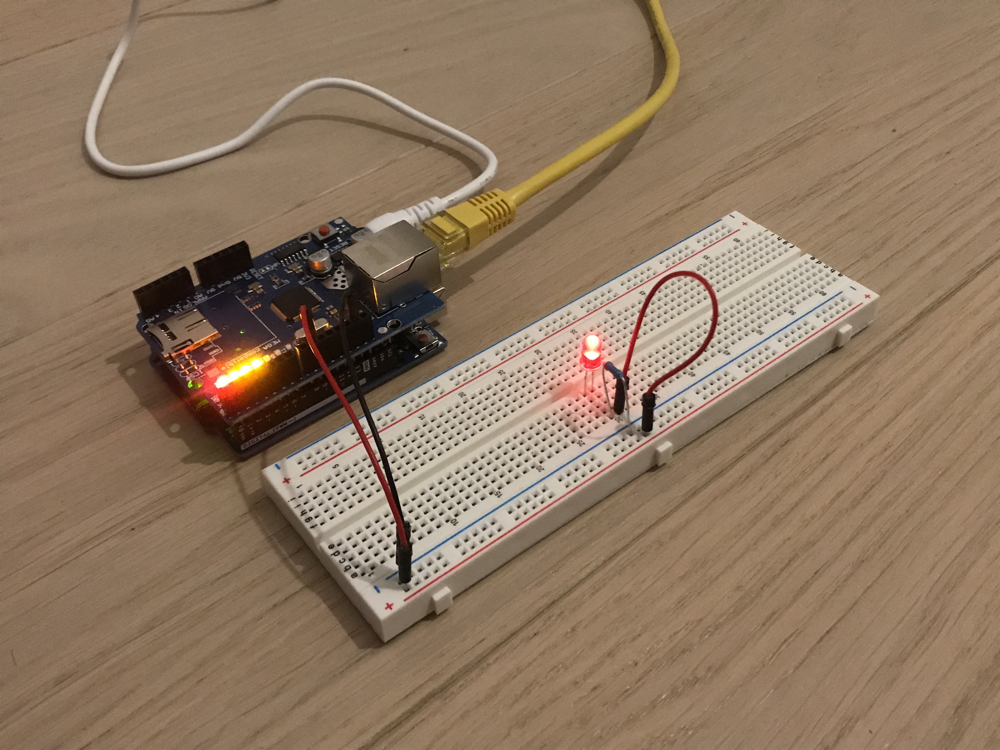
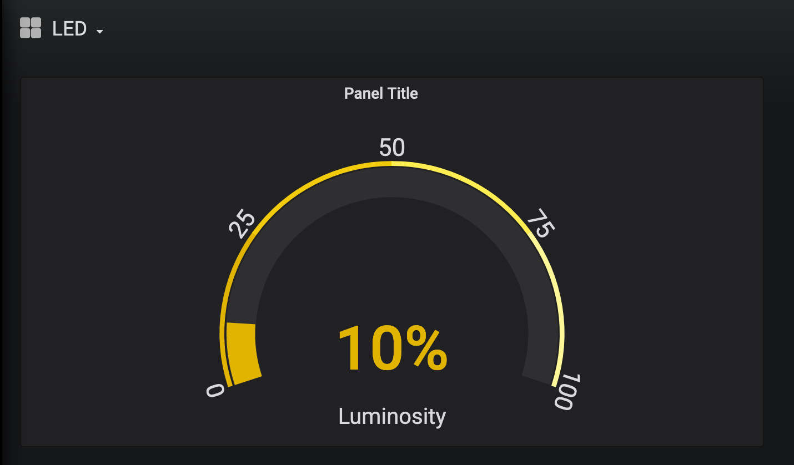

# Command LED IoT Project
This project demonstrates a simple way to control the luminosity of an LED using MQTT to issue commands and push data into a remote database.

# Getting Started

1. Clone this repo.
2. Run `docker-compose up`
3. Copy Arduino files into your Ardunio IDE.
4. [Set the broker IP](https://github.com/APiercey/command-led-iot/blob/master/arduino-project/set_led_over_ethernet.ino#L8).
5. Setup the Arduino and LED.
6. Verify and Upload!

# Technologies Used
- [InfluxDB](https://www.influxdata.com/): A time-series database which will store the luminosity of the LED.
- [Grafana](https://grafana.com/): A visualization tool used to turn data into graphs. We will use the data stored in InfluxDB.
- [Mosquitto](https://mosquitto.org/): A M-to-M message broker. We will use this push data from the Ardunio device as well as recieve instructions.

## The Project
- [Command Bridge](https://github.com/APiercey/command-led-iot/tree/master/command-bridge): The custom Elixir application will push data into InfluxDB and issue commands to the device.
- [Arduino Project](https://github.com/APiercey/command-led-iot/tree/master/arduino-project): The Arduino build. This includes ZIPed libraries needed for it to work.
  - The project Relies on [ArduinoJSON](https://arduinojson.org/v6/doc/installation/) but wasn't included. The most recent version can be installed using the Arduino Library manager and I recommend taking this route. I've included the header file - which is version 6.15.1
  - MQTT library is ziped. Add it to the Arduino IDE.

## The Build
The arduino will `analogWrite` to pin 9. Anode (long end) is hooked up to the pin. For the cathode, I used a 220 ohm resistor.

For this project, I used an (deprecated) Ardunio Ethernet shield because that was all I had! I'm 100% positive this can be done with any sort of shield used to connect the ardunio to the internet - you will just need a different library other than the Ethernet one.

Here is a picture, quite simple:


## Graphing the Data
The project only records luminosity. The data will be stored into a InfluxDB named `devices` under the measurment `led`.

Using the query:
```
SELECT last(luminosity) FROM led
```

I produced this graph which shows that the lumonsity of the LED is at 10%:


## Subscribing to the MQTT Broker
Make sure you are using the [correct address for your MQTT broker](https://github.com/APiercey/command-led-iot/blob/master/arduino-project/set_led_over_ethernet.ino#L8). This will eaither be ana IP address your network supplied for your computer - if the service is running locally - or the public IP if running "in the cloud" ;).

## Issuing Commands
The Command-Bridge includes an JSON endpoint for setting the lumonsity. I've included some make targets to get started in the [Makefile](https://github.com/APiercey/command-led-iot/blob/master/Makefile#L6).

You can use [mosquitto_sub](https://mosquitto.org/man/mosquitto_sub-1.html) and [mosquitto_pub](https://mosquitto.org/man/mosquitto_pub-1.html) to monitor and push data into the topics to watch the data in real time! See the Makefile for more commands about this.


